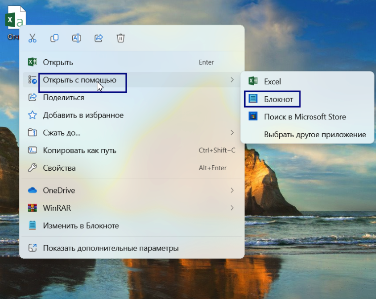

# Конвертация отчета

Для загрузки[ еженедельного отчета для Министерства науки и высшего образования РФ](https://informa.gitbook.io/otchet-dlya-minobrnauki-rf) требуется CSV UTF-8(разделители-запятые).&#x20;

<figure><figcaption></figcaption></figure>

Если на компьютере установлена версия Microsoft Office ранее 2019, то данная кодировка (CSV UTF-8 (разделители-запятые)) отсутствует. Для приведения файла к верному формату необходимо:

1. Найти файл с отчетом в формате CSV на вашем компьютере.
2. Щелкнуть правой кнопкой мыши на файле и выбрать "Открыть с помощью" → "Блокнот".

<figure><figcaption></figcaption></figure>

3. В Блокноте перейти в меню "Файл" и выбрать "Сохранить как...".

<figure><figcaption></figcaption></figure>

4. В открывшемся окне выбрать "Кодировка" и установите значение "UTF-8 с спецификацией".

<figure><figcaption></figcaption></figure>

5. В поле "Имя файла" добавить в конце название файла ".csv" (например, "отчет.csv").
6. Нажать "Сохранить".

